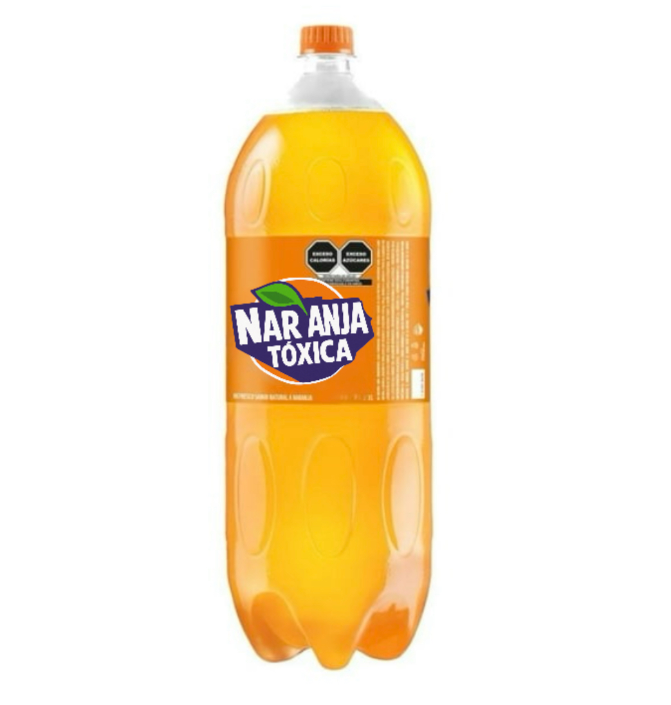

# REFRESCO-NARANJA-T-XICA
<!DOCTYPE html>
<html lang="es">
<head>
    <meta charset="UTF-8" />
    <meta name="viewport" content="width=device-width, initial-scale=1" />
    <title>Naranja Tóxica</title>
    
</head>
<body>
    <h1>Naranja Tóxica</h1>
    
    

        Refresco lleno de azúcares y químicos que prometen un sabor artificial.  
        ¡Perfecto para intoxicar tu cuerpo con cada sorbo! 
        #AntiPublicidad #NaranjaTóxica
    

</body>
</html>
